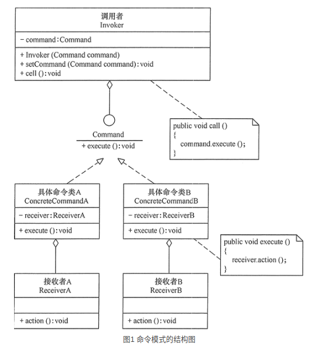
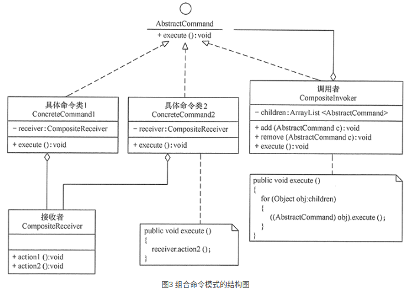

### 引言

------

+ 在软件开发系统中，常常出现“方法的请求者”与“方法的实现者”之间存在紧密的耦合关系。这不利于软件功能的扩展与维护。例如，想对行为进行“撤销、重做、记录”等处理都很不方便，因此“如何将方法的请求者与方法的实现者解耦？”变得很重要，命令模式能很好地解决这个问题。

+ 在现实生活中，这样的例子也很多，例如，电视机遥控器（命令发送者）通过按钮（具体命令）来遥控电视机（命令接收者），还有计算机键盘上的“功能键”等。

### 命令模式的定义与特点

------

+ **命令（Command）模式**的定义如下：将一个请求封装为一个对象，使发出请求的责任和执行请求的责任分割开。这样两者之间通过命令对象进行沟通，这样方便将命令对象进行储存、传递、调用、增加与管理。

+ 命令模式的主要优点如下。

  + 降低系统的耦合度。命令模式能将调用操作的对象与实现该操作的对象解耦。
  + 增加或删除命令非常方便。采用命令模式增加与删除命令不会影响其他类，它满足“开闭原则”，对扩展比较灵活。
  + 可以实现宏命令。命令模式可以与[组合模式](http://c.biancheng.net/view/1373.html)结合，将多个命令装配成一个组合命令，即宏命令。

  1. 方便实现 Undo 和 Redo 操作。命令模式可以与后面介绍的[备忘录模式](http://c.biancheng.net/view/1400.html)结合，实现命令的撤销与恢复。

+ 其缺点是：
  + 可能产生大量具体命令类。因为对每一个具体操作都需要设计一个具体命令类，这将增加系统的复杂性。

### 命令模式的结构与实现

------

+ 可以将系统中的相关操作抽象成命令，使调用者与实现者相关分离，其结构如下。

+ **模式的结构**
  + 命令模式包含以下主要角色。

    + 抽象命令类（Command）角色：声明执行命令的接口，拥有执行命令的抽象方法 execute()。
    + 具体命令角色（Concrete Command）角色：是抽象命令类的具体实现类，它拥有接收者对象，并通过调用接收者的功能来完成命令要执行的操作。
    + 实现者/接收者（Receiver）角色：执行命令功能的相关操作，是具体命令对象业务的真正实现者。
    + 调用者/请求者（Invoker）角色：是请求的发送者，它通常拥有很多的命令对象，并通过访问命令对象来执行相关请求，它不直接访问接收者。

  + 其结构图如图 1 所示。

    

+  **模式的实现**

  + 命令模式的代码如下：

    ```java
    package command;
    public class CommandPattern
    {
        public static void main(String[] args)
        {
            Command cmd=new ConcreteCommand();
            Invoker ir=new Invoker(cmd);
            System.out.println("客户访问调用者的call()方法...");
            ir.call();
        }
    }
    //调用者
    class Invoker
    {
        private Command command;
        public Invoker(Command command)
        {
            this.command=command;
        }
        public void setCommand(Command command)
        {
            this.command=command;
        }
        public void call()
        {
            System.out.println("调用者执行命令command...");
            command.execute();
        }
    }
    //抽象命令
    interface Command
    {
        public abstract void execute();
    }
    //具体命令
    class ConcreteCommand implements Command
    {
        private Receiver receiver;
        ConcreteCommand()
        {
            receiver=new Receiver();
        }
        public void execute()
        {
            receiver.action();
        }
    }
    //接收者
    class Receiver
    {
        public void action()
        {
            System.out.println("接收者的action()方法被调用...");
        }
    }
    ```

### 命令模式的应用实例

------

+ 详见代码(可结合命令模式_案例示意图.png进行查看,以便于理解).

### 命令模式的应用场景

------

+ 命令模式通常适用于以下场景。
  + 当系统需要将请求调用者与请求接收者解耦时，命令模式使得调用者和接收者不直接交互。
  + 当系统需要随机请求命令或经常增加或删除命令时，命令模式比较方便实现这些功能。
  + 当系统需要执行一组操作时，命令模式可以定义宏命令来实现该功能。
  + 当系统需要支持命令的撤销（Undo）操作和恢复（Redo）操作时，可以将命令对象存储起来，采用备忘录模式来实现。

### 命令模式的扩展

------

+ 在软件开发中，有时将命令模式与前面学的组合模式联合使用，这就构成了宏命令模式，也叫组合命令模式。宏命令包含了一组命令，它充当了具体命令与调用者的双重角色，执行它时将递归调用它所包含的所有命令，其具体结构图如图 3 所示。

  

  程序代码如下：

  ```java
  package command;
  import java.util.ArrayList;
  public class CompositeCommandPattern
  {
      public static void main(String[] args)
      {
          AbstractCommand cmd1=new ConcreteCommand1();
          AbstractCommand cmd2=new ConcreteCommand2();
          CompositeInvoker ir=new CompositeInvoker();
          ir.add(cmd1);
          ir.add(cmd2);
          System.out.println("客户访问调用者的execute()方法...");
          ir.execute();
      }
  }
  //抽象命令
  interface AbstractCommand
  {
      public abstract void execute();
  }
  //树叶构件: 具体命令1
  class ConcreteCommand1 implements AbstractCommand
  {
      private CompositeReceiver receiver;
      ConcreteCommand1()
      {
          receiver=new CompositeReceiver();
      }
      public void execute()
      {       
          receiver.action1();
      }
  }
  //树叶构件: 具体命令2
  class ConcreteCommand2 implements AbstractCommand
  {
      private CompositeReceiver receiver;
      ConcreteCommand2()
      {
          receiver=new CompositeReceiver();
      }
      public void execute()
      {       
          receiver.action2();
      }
  }
  //树枝构件: 调用者
  class CompositeInvoker implements AbstractCommand
  {
      private ArrayList<AbstractCommand> children = new ArrayList<AbstractCommand>();   
      public void add(AbstractCommand c)
      {
          children.add(c);
      }   
      public void remove(AbstractCommand c)
      {
          children.remove(c);
      }   
      public AbstractCommand getChild(int i)
      {
          return children.get(i);
      }   
      public void execute()
      {
          for(Object obj:children)
          {
              ((AbstractCommand)obj).execute();
          }
      }    
  }
  //接收者
  class CompositeReceiver
  {
      public void action1()
      {
          System.out.println("接收者的action1()方法被调用...");
      }
      public void action2()
      {
          System.out.println("接收者的action2()方法被调用...");
      }
  }
  ```

+ 当然，命令模式还可以同备忘录（Memento）模式组合使用，这样就变成了可撤销的命令模式，这将在后面介绍。

