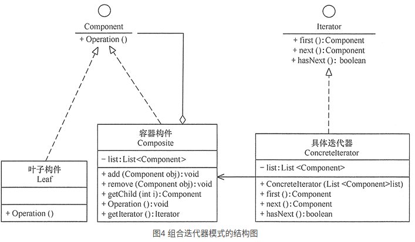

### 引言

------

+ 在现实生活以及程序设计中，经常要访问一个聚合对象中的各个元素，如“[数据结构](http://c.biancheng.net/data_structure/)”中的链表遍历，通常的做法是将链表的创建和遍历都放在同一个类中，但这种方式不利于程序的扩展，如果要更换遍历方法就必须修改程序源代码，这违背了 “开闭原则”。

+ 既然将遍历方法封装在聚合类中不可取，那么聚合类中不提供遍历方法，将遍历方法由用户自己实现是否可行呢？答案是同样不可取，因为这种方式会存在两个缺点：
  + 暴露了聚合类的内部表示，使其数据不安全；
  + 增加了客户的负担。

+ “迭代器模式”能较好地克服以上缺点，它在客户访问类与聚合类之间插入一个迭代器，这分离了聚合对象与其遍历行为，对客户也隐藏了其内部细节，且满足“单一职责原则”和“开闭原则”，如 [Java](http://c.biancheng.net/java/) 中的 Collection、List、Set、Map 等都包含了迭代器。

### 模式的结构与实现

------

+ **迭代器模式**是通过将聚合对象的遍历行为分离出来，抽象成迭代器类来实现的，其目的是在不暴露聚合对象的内部结构的情况下，让外部代码透明地访问聚合的内部数据。现在我们来分析其基本结构与实现方法。

+  **模式的结构**

  + 迭代器模式主要包含以下角色。
    + 抽象聚合（Aggregate）角色：定义存储、添加、删除聚合对象以及创建迭代器对象的接口。
    + 具体聚合（ConcreteAggregate）角色：实现抽象聚合类，返回一个具体迭代器的实例。
    + 抽象迭代器（Iterator）角色：定义访问和遍历聚合元素的接口，通常包含 hasNext()、first()、next() 等方法。
    + 具体迭代器（Concretelterator）角色：实现抽象迭代器接口中所定义的方法，完成对聚合对象的遍历，记录遍历的当前位置。

  + 其结构图如图 1 所示。

    

+ **模式的实现**

  + 迭代器模式的实现代码如下：

  ```java
  package iterator;
  import java.util.*;
  public class IteratorPattern
  {
      public static void main(String[] args)
      {
          Aggregate ag=new ConcreteAggregate(); 
          ag.add("中山大学"); 
          ag.add("华南理工"); 
          ag.add("韶关学院");
          System.out.print("聚合的内容有：");
          Iterator it=ag.getIterator(); 
          while(it.hasNext())
          { 
              Object ob=it.next(); 
              System.out.print(ob.toString()+"\t"); 
          }
          Object ob=it.first();
          System.out.println("\nFirst："+ob.toString());
      }
  }
  //抽象聚合
  interface Aggregate
  { 
      public void add(Object obj); 
      public void remove(Object obj); 
      public Iterator getIterator(); 
  }
  //具体聚合
  class ConcreteAggregate implements Aggregate
  { 
      private List<Object> list=new ArrayList<Object>(); 
      public void add(Object obj)
      { 
          list.add(obj); 
      }
      public void remove(Object obj)
      { 
          list.remove(obj); 
      }
      public Iterator getIterator()
      { 
          return(new ConcreteIterator(list)); 
      }     
  }
  //抽象迭代器
  interface Iterator
  {
      Object first();
      Object next();
      boolean hasNext();
  }
  //具体迭代器
  class ConcreteIterator implements Iterator
  { 
      private List<Object> list=null; 
      private int index=-1; 
      public ConcreteIterator(List<Object> list)
      { 
          this.list=list; 
      } 
      public boolean hasNext()
      { 
          if(index<list.size()-1)
          { 
              return true;
          }
          else
          {
              return false;
          }
      }
      public Object first()
      {
          index=0;
          Object obj=list.get(index);;
          return obj;
      }
      public Object next()
      { 
          Object obj=null; 
          if(this.hasNext())
          { 
              obj=list.get(++index); 
          } 
          return obj; 
      }   
  }
  ```

  

### 模式的应用实例

------

+ 详见代码

### 模式的应用场景

------

+ 前面介绍了关于迭代器模式的结构与特点，下面介绍其应用场景，迭代器模式通常在以下几种情况使用。
  + 当需要为聚合对象提供多种遍历方式时。
  + 当需要为遍历不同的聚合结构提供一个统一的接口时。
  + 当访问一个聚合对象的内容而无须暴露其内部细节的表示时。

+ 由于聚合与迭代器的关系非常密切，所以大多数语言在实现聚合类时都提供了迭代器类，因此大数情况下使用语言中已有的聚合类的迭代器就已经够了。

### 模式的扩展

------

+ 迭代器模式常常与[组合模式](http://c.biancheng.net/view/1373.html)结合起来使用，在对组合模式中的容器构件进行访问时，经常将迭代器潜藏在组合模式的容器构成类中。当然，也可以构造一个外部迭代器来对容器构件进行访问，其结构图如图 4 所示。

