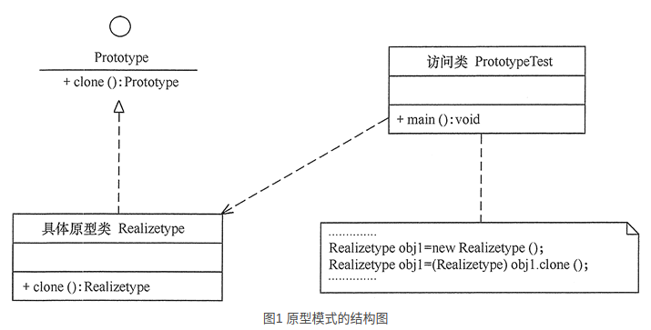

### 原型模式的定义与特点

------

+ 原型（Prototype）模式的定义如下：用一个已经创建的实例作为原型，通过复制该原型对象来创建一个和原型相同或相似的新对象。在这里，原型实例指定了要创建的对象的种类。用这种方式创建对象非常高效，根本无须知道对象创建的细节。例如，Windows 操作系统的安装通常较耗时，如果复制就快了很多。在生活中复制的例子非常多，这里不一一列举了。

### 原型模式的结构与实现

------

+ 由于 [Java](http://c.biancheng.net/java/) 提供了对象的 clone() 方法，所以用 Java 实现原型模式很简单。

+  **模式的结构**

  + 原型模式包含以下主要角色。
    + 抽象原型类：规定了具体原型对象必须实现的接口。
    + 具体原型类：实现抽象原型类的 clone() 方法，它是可被复制的对象。
    + 访问类：使用具体原型类中的 clone() 方法来复制新的对象。

  + 其结构图如图 1 所示。
    + 

+ **模式的实现**

  + 原型模式的克隆分为浅克隆和深克隆，Java 中的 Object 类提供了浅克隆的 clone() 方法，具体原型类只要实现 Cloneable 接口就可实现对象的浅克隆，这里的 Cloneable 接口就是抽象原型类。其代码如下：

  + ```java
    //具体原型类
    class Realizetype implements Cloneable
    {
        Realizetype()
        {
            System.out.println("具体原型创建成功！");
        }
        public Object clone() throws CloneNotSupportedException
        {
            System.out.println("具体原型复制成功！");
            return (Realizetype)super.clone();
        }
    }
    //原型模式的测试类
    public class PrototypeTest
    {
        public static void main(String[] args)throws CloneNotSupportedException
        {
            Realizetype obj1=new Realizetype();
            Realizetype obj2=(Realizetype)obj1.clone();
            System.out.println("obj1==obj2?"+(obj1==obj2));
        }
    }
    ```

    

### 原型模式的应用实例

------

+ 详见代码

### 原型模式的应用场景

------

+ 原型模式通常适用于以下场景。
  + 对象之间相同或相似，即只是个别的几个属性不同的时候。
  + 对象的创建过程比较麻烦，但复制比较简单的时候。