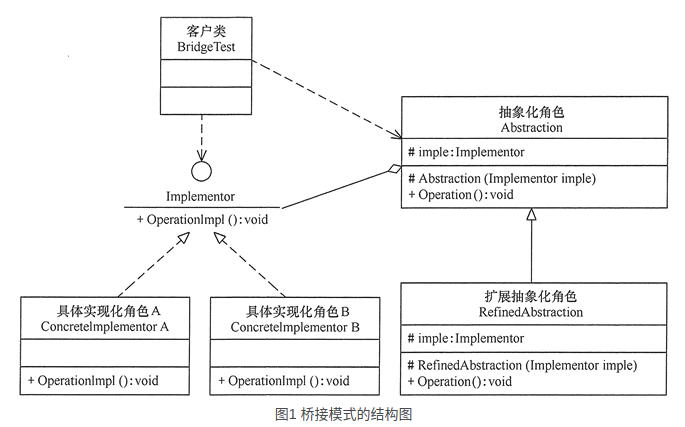

### 引言

------

- 在现实生活中，某些类具有两个或多个维度的变化，如图形既可按形状分，又可按颜色分。如何设计类似于 Photoshop 这样的软件，能画不同形状和不同颜色的图形呢？如果用继承方式，m 种形状和 n 种颜色的图形就有 m×n 种，不但对应的子类很多，而且扩展困难。
- 当然，这样的例子还有很多，如不同颜色和字体的文字、不同品牌和功率的汽车、不同性别和职业的男女、支持不同平台和不同文件格式的媒体播放器等。如果用桥接模式就能很好地解决这些问题。

### 桥接模式的定义与特点

------

* **可以将抽象化部分与实现化部分分开，取消二者的继承关系，改用组合关系。**

+ **模式的结构**

  + 桥接（Bridge）模式包含以下主要角色。
    + 抽象化（Abstraction）角色：定义抽象类，并包含一个对实现化对象的引用。
    + 扩展抽象化（Refined    Abstraction）角色：是抽象化角色的子类，实现父类中的业务方法，并通过组合关系调用实现化角色中的业务方法。
    + 实现化（Implementor）角色：定义实现化角色的接口，供扩展抽象化角色调用。
    + 具体实现化（Concrete Implementor）角色：给出实现化角色接口的具体实现。

  + 其结构图如图 1 所示。

    

+ **模式的实现**

  + 桥接模式的代码如下：

  ```java
  package bridge;
  public class BridgeTest
  {
      public static void main(String[] args)
      {
          Implementor imple=new ConcreteImplementorA();
          Abstraction abs=new RefinedAbstraction(imple);
          abs.Operation();
      }
  }
  //实现化角色
  interface Implementor
  {
      public void OperationImpl();
  }
  //具体实现化角色
  class ConcreteImplementorA implements Implementor
  {
      public void OperationImpl()
      {
          System.out.println("具体实现化(Concrete Implementor)角色被访问" );
      }
  }
  //抽象化角色
  abstract class Abstraction
  {
     protected Implementor imple;
     protected Abstraction(Implementor imple)
     {
         this.imple=imple;
     }
     public abstract void Operation();   
  }
  //扩展抽象化角色
  class RefinedAbstraction extends Abstraction
  {
     protected RefinedAbstraction(Implementor imple)
     {
         super(imple);
     }
     public void Operation()
     {
         System.out.println("扩展抽象化(Refined Abstraction)角色被访问" );
         imple.OperationImpl();
     }
  }
  ```

### 桥接模式的应用实例

------

+ 详见代码

### 桥接模式的应用场景

------

+ 桥接模式通常适用于以下场景。
  + 当一个类存在两个独立变化的维度，且这两个维度都需要进行扩展时。
  + 当一个系统不希望使用继承或因为多层次继承导致系统类的个数急剧增加时。
  + 当一个系统需要在构件的抽象化角色和具体化角色之间增加更多的灵活性时。